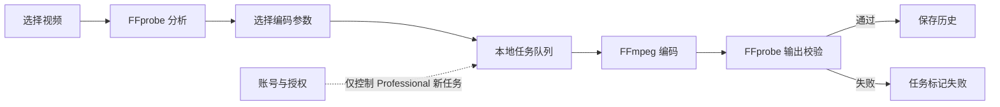

# VideoDelite

> 简单、快速、本地优先的视频压缩工具。视频在你的电脑上完成分析、编码与验证。

[](https://github.com/felixniun/VideoDeLite)
[](https://go.dev/)
[](https://wails.io/)
[](https://vuejs.org/)

VideoDelite 是一款面向 Windows 的桌面视频压缩应用。它将 Vue 3 界面与 Go 媒体处理管线组合在一起，调用 FFmpeg / FFprobe 在本机完成视频分析、编码和输出校验。

## 目录

- [产品能力](#产品能力)
- [设计原则](#设计原则)
- [处理流程](#处理流程)
- [开发环境](#开发环境)
- [构建与运行](#构建与运行)
- [命令行模式](#命令行模式)
- [数据与隐私](#数据与隐私)
- [项目结构](#项目结构)
- [文档](#文档)

## 产品能力

### Simple 模式

- H.264 / H.265，低 / 中 / 高三档画质，MP4 / MKV 容器。
- 自动检测可用编码器，优先使用硬件编码；遇到可回退的硬件错误时切换到 CPU 编码。
- 从文件或文件夹导入视频，查看媒体信息，并在任务页查看进度、暂停、恢复、取消或重试。
- 输出经过 FFprobe 校验后才会记为完成；本地 SQLite 保存任务历史。

### Professional 模式与当前状态

Professional 的配置界面、编码参数模型和授权状态机已在代码库中。当前普通运行状态默认没有授权，界面将此模式显示为需要授权 / 尚未开放；请以 Simple 模式作为当前可用产品路径。产品需求和历史交付记录见[文档索引](docs/README.md)。

### 桌面体验

- 中文 / English；浅色 / 深色主题。
- Windows 原生桌面应用，通过 Wails 与 Vue 3 前端连接。
- FFmpeg / FFprobe 可由 PATH 查找，也可在应用设置中指定路径。

## 设计原则

1. **本地处理。** 视频文件读取、媒体分析、编码、输出验证、历史记录和日志均由本机处理。账号相关网络请求不传输视频内容。
2. **校验后才算完成。** FFmpeg 退出成功不足以确认产物可用；输出必须通过 FFprobe 检查。
3. **账号与编码解耦。** 授权只决定能否创建需要许可的新任务，不介入 FFmpeg 执行；授权或网络状态变化不应终止正在运行的任务。
4. **Simple 无需登录。** 本地视频压缩不依赖账号服务。

## 处理流程



## 开发环境

- Windows 10（Build 19041 或更新版本）或 Windows 11。
- Go 1.27 或更新版本。
- Node.js 20 或更新版本及 npm。
- Wails CLI v2.16.0。
- FFmpeg 和 FFprobe：安装到 PATH，或在应用设置中指定可执行文件路径。
- Windows 桌面运行需要 WebView2 Runtime。

安装 Wails CLI：

```powershell
go install github.com/wailsapp/wails/v2/cmd/wails@v2.16.0
```

## 构建与运行

```powershell
# 安装前端依赖
cd frontend
npm ci
cd ..

# 启动桌面开发模式
wails dev

# 构建 Windows 应用
wails build
```

构建产物默认输出到 `build/bin/VideoDelite.exe`。打包脚本、安装程序及签名流程见[项目结构说明](<docs/guides/PROJECT-STRUCTURE.md>)与 `build/`、`installer/`。

## 命令行模式

`--cli` 使用与桌面应用相同的任务管线，适合本机分析和简单编码：

```powershell
.\build\bin\VideoDelite.exe --cli analyze "C:\Videos\input.mp4"
.\build\bin\VideoDelite.exe --cli encode "C:\Videos\input.mp4" --codec h265 --quality high --container mkv --encoder auto --out "C:\Videos\Compressed"
```

编码器可选 `auto`、`cpu`、`nvenc`、`qsv`、`amf`。硬件编码器是否可用取决于本机 GPU、驱动和 FFmpeg 构建。

## 数据与隐私

媒体处理数据不会上传。任务历史、应用设置和日志保存在本机；数据目录优先使用应用目录下的 `Data/`，不可写时回退到 `%LOCALAPPDATA%/VideoDelite/`。默认输出目录为用户 Videos 下的 `Compressed/`。

账号功能启用时，网络请求仅用于账号 / 设备 / 授权服务。数据项和隐私承诺见[隐私政策](docs/PRIVACY-POLICY.md)。

## 项目结构

```text
VideoDelite/
├── app.go, main.go, cli.go  # Wails 入口、Go 绑定与 CLI
├── frontend/                # Vue 3 + TypeScript 界面
├── internal/                # 媒体分析、编码、任务、验证、历史等客户端核心
├── server/                  # 账号与授权 HTTP 服务
├── cmd/videoserver/         # 服务端入口与配置模板
├── tools/                   # 验证矩阵与开发工具
├── build/                   # 构建、打包、部署脚本及配置
├── installer/               # Windows 安装程序
└── docs/                    # 产品、指南、运维与验证文档
```

详见[代码目录导览](<docs/guides/PROJECT-STRUCTURE.md>)。

## 文档

- [文档索引与业务需求摘要](docs/README.md)
- [产品需求基准](<docs/product/VideoLite计划书.md>)
- [账号与本地压缩边界](<docs/product/VideoLite 账号与本地压缩边界规范.md>)
- [MVP 交付记录](<docs/product/VideoDelite MVP交付计划书.md>)
- [从零到上线学习指南](<docs/guides/学习指南-从零到上线.md>)
- [Debian 部署指南](docs/operations/DEPLOY-DEBIAN.md)
- [技术验证报告](docs/reports/TECHNICAL-VALIDATION.md)
- [媒体保留 QA 报告](docs/reports/QA-PRESERVATION.md)
- [隐私政策](docs/PRIVACY-POLICY.md)
- [版本说明](docs/RELEASE-NOTES.md)

## 账号服务端（可选）

仓库包含独立的 Go 账号服务端和 Docker Compose 配置。服务端仅承担账号与授权职责，不参与媒体处理；本地 Simple 模式开发和使用不需要启动它。部署前请按[部署指南](docs/operations/DEPLOY-DEBIAN.md)配置数据库、管理密钥和邮件服务，不要直接使用 Compose 文件中的占位值。

## 许可证

当前仓库未包含 `LICENSE` 文件。使用或再分发前，请先与项目维护者确认许可条款。
